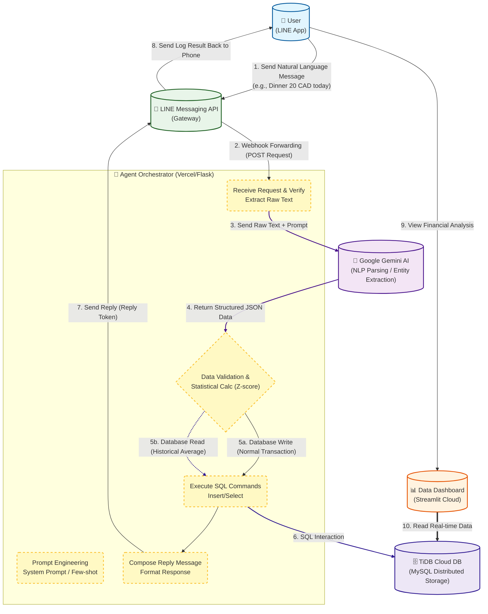

<h1 align="center">🤖 Conversational AI Expense Tracking Agent </h1>

  
  
  
  

> **Project Overview:** An end-to-end automated financial analytics system that utilizes Generative AI to transform unstructured natural language (chat messages) into structured, visual business insights. 

---

## 📑 Step 1: Identify a Business Use Case

**The Problem: User Friction in Personal Finance Management (PFM)**
Traditional expense tracking applications suffer from high cognitive load and "UI friction." Users must navigate through 4 to 5 steps (open app ➡️ select date ➡️ find category ➡️ input amount ➡️ save) just to log a single transaction. This friction leads to high user churn rates and inconsistent data entry.

**The Generative AI Solution & Business Value**
By implementing a **Conversational User Interface (CUI)** powered by Generative AI, we reduce the data entry process from multiple clicks to a single natural language message (e.g., *"Spent 15 CAD on lunch today"*). 
* **For Users:** Zero-friction logging using their existing messaging habits (LINE app).
* **For Business:** Increased Daily Active Users (DAU), higher data retention, and the creation of a high-quality financial dataset that can be used to drive personalized financial products or budget alerts.

---

## 🧠 Step 2: Model Selection

To achieve accurate real-time parsing, **Google Gemini (Flash-lite)** was selected as the core Large Language Model (LLM) for this agentic workflow. 

**Justification:**
1. **Semantic Understanding & Entity Extraction:** Unlike rule-based bots, Gemini handles fuzzy logic and mixed contexts (e.g., handling mixed currencies like CAD and TWD, or implicit categories).
2. **Low Latency:** Crucial for messaging platforms where users expect sub-second responses.
3. **Native JSON Generation:** Gemini excels at strictly outputting machine-readable JSON formats, which is mandatory for safe database insertion.
4. **Multilingual Prowess:** Perfectly supports Traditional Chinese and English interchangeably.

---

## ⚙️ Step 3: Model Adaptation

To ensure the LLM acts strictly as a data-extraction agent rather than a conversational chatbot, advanced **Prompt Engineering** and **Statistical Modeling** were applied.

* **Strict Prompt Formulation:** The system prompt forces the LLM to map unstructured text into a predetermined JSON schema: `{"date": "YYYY-MM-DD", "item": "str", "category": "str", "amount": "float", "currency": "str"}`.
* **Few-Shot Learning:** Embedded examples within the prompt to handle edge cases (e.g., negative amounts for expenses, positive for income).
* **Statistical Anomaly Detection (Z-score):** Once the AI extracts the data, the backend executes a Z-score algorithm against the user's historical database. If the new expense deviates significantly from their average, the system automatically triggers a budget warning.

---

## 🚀 Step 4: Implementation & Prototype

The prototype is fully functional and deployed using a microservices architecture. It acts as an autonomous agent that receives text, parses data, executes SQL commands, and visualizes KPIs.

### System Architecture
1. **User Interface:** LINE Messaging App (Input) & Streamlit Dashboard (Visualization).
2. **Agentic Backend (Python/Flask):** Deployed on **Vercel** serverless functions. It acts as the orchestrator.
3. **LLM Processing:** Google Gemini API extracts and standardizes the entities.
4. **Cloud Storage:** **TiDB Cloud (MySQL)** securely stores the structured transactions.

### 🎥 Demonstration

| 1. Zero-Friction Input (LINE Bot) | 2. Real-Time Analytics (Streamlit) |
| :---: | :---: |
|  |  |

**How it solves the problem:** The user simply types naturally. The AI Agent intercepts the text, structures it, logs it into the cloud, and the Streamlit dashboard instantly updates the budget burn rate and expense charts—completely eliminating traditional UI friction.

---
*Developed by [Fuwei Tsai](https://github.com/fuwei-tsai)*
